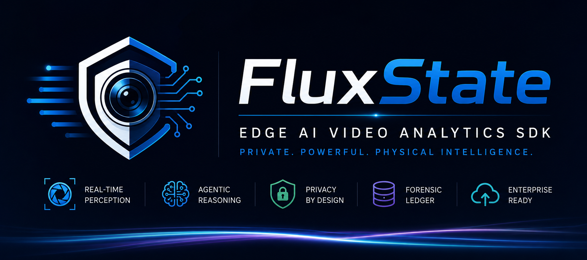
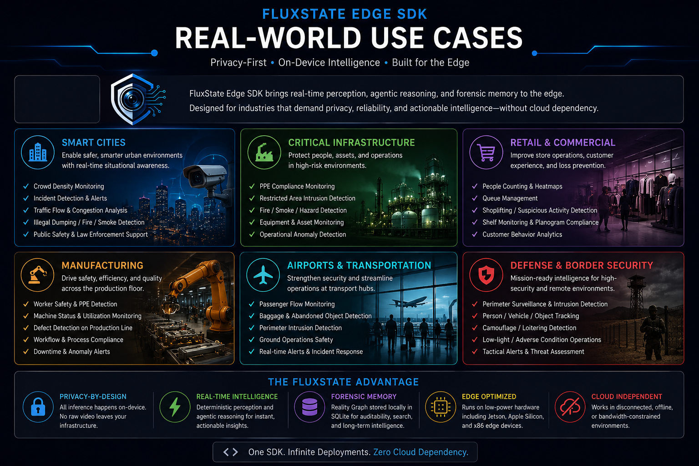

# FluxState: Edge Intelligence SDK




**FluxState Edge** is an extensible, camera-agnostic video analytics SDK designed for integration into enterprise security backends. It processes RTSP streams locally on the edge, extracting behavioral metadata using a combination of object detection, 3D skeletal posing, audio processing, and VLM (Vision-Language Model) semantic reasoning.

---

## 🖼️ Architecture & Use Cases



---

## 🚀 Core Capabilities

- **Temporal Forensic Database:** Events and behavioral anomalies are logged directly into a local SQLite database (`core/forensics.py`). This creates a searchable text-based ledger of physical events.
- **Agentic VLM Reasoner:** The architecture intercepts complex spatial events and runs Vision-Language Models (e.g., Qwen2.5-VL) locally via MLX on Apple Silicon unified memory for deep contextual scene understanding.
- **Tactical Visual Grounding:** Automatically draws explicit red bounding boxes on target anomalies and utilizes strict, unbiased OSINT prompts to force the VLM to classify threats with pinpoint accuracy.
- **C-Level Memory Mitigation:** FluxState uses `ctypes.memset` to manually zero out numpy array pixel buffers at the C-level immediately after inference to mitigate image retention in the Python heap.
- **Hardware Agnostic (RTSP):** Connects to existing IP cameras via standard RTSP URLs without requiring proprietary recording hardware.
- **Containerized Edge Deployment:** Includes a highly optimized `Dockerfile` for enterprise edge deployments (e.g., Kubernetes/Docker Swarm), solving native OS dependencies.

---

## 📦 Installation & Deployment

### Option A: Enterprise Docker Deployment (Recommended)
For production environments, use the provided Docker container to guarantee system dependencies (Tesseract, PortAudio) are perfectly locked.
```bash
docker build -t fluxstate-edge .
docker run -d --name fluxstate-edge fluxstate-edge
```

### Option B: Local Python Development
```bash
# macOS
brew install tesseract portaudio
# Linux
sudo apt-get install tesseract-ocr libportaudio2 libportaudiocpp0 portaudio19-dev

pip install fluxstate-edge
```

---

## 🛠️ SDK Integration

FluxState is designed to be embedded into your proprietary backend.

### Minimal 5-Line Integration
Create an entrypoint script (e.g., `main.py`):

```python
import time
from app import FluxStateNode

# Initialize the SDK
sdk = FluxStateNode()

# Define your integration hook
def handle_threat(event_payload):
    print(f"\n[INTEGRATION BUS] Threat Detected! Escalating to VMS...")
    print(f"Target Identity: {event_payload['entities']}")
    print(f"Behavioral Vector: {event_payload['context_log']}")

# Bind the hook to the SDK
sdk.on_threat_detected = handle_threat

# Deploy Headlessly (Runs as a background daemon)
sdk.start_headless_daemon()

try:
    while True: 
        time.sleep(1)
except KeyboardInterrupt:
    print("Shutting down SDK cleanly...")
    sdk.stop()
```

---

## 🧪 Testing
FluxState ships with an automated `pytest` suite covering the Forensic SQLite ledger and JSON intelligence policies.
```bash
pytest tests/
```

---

## 🛡️ Architecture Overview
Please refer to the `architecture.md` file in the source repository for a deeper dive into the threading model, the VLM integration pipeline, and the SQLite database schema.
