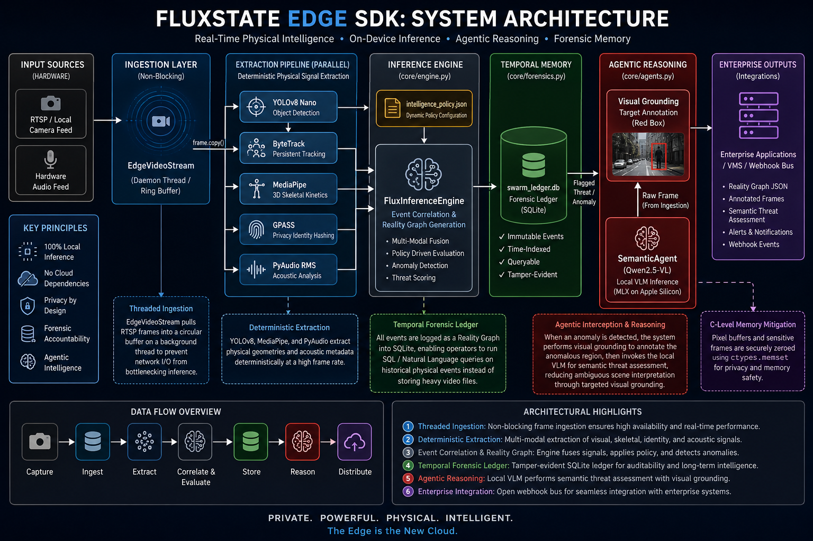

<div align="center">


# 🦅 FluxState Edge SDK

**Privacy-Preserving Contextual Edge Video Analytics for Enterprise Security**

[](https://pypi.org/project/fluxstate-edge/)
[](https://opensource.org/licenses/MIT)
[]()

<br>

*FluxState Edge* is an extensible, camera-agnostic video analytics SDK designed for direct integration into proprietary security backends. It processes RTSP streams locally on the edge, extracting behavioral metadata via object detection, 3D skeletal posing, audio processing, and VLM semantic reasoning.

</div>

---

<br>

## ⚡ System Capabilities

| Capability | Technical Implementation |
| :--- | :--- |
| 🧠 **Agentic VLM Reasoner** | Runs Vision-Language Models (e.g., `Qwen2.5-VL`) locally via MLX on Apple Silicon unified memory for deep contextual scene understanding. Bypasses cloud APIs entirely. |
| 🎯 **Tactical Visual Grounding** | Automatically injects high-contrast red bounding boxes over anomalies. This guides the VLM toward the detected region, reducing irrelevant reasoning and improving contextual grounding. |
| 🛡️ **Privacy-by-Design** | Actively zeroes out image buffers post-inference via C-level `memset`. Designed with privacy-first principles to prevent sensitive pixel data from lingering in the system heap. |
| 🗄️ **Temporal Forensics** | Behavioral anomalies are serialized into a local SQLite database (`core/forensics.py`), creating a searchable text-based ledger of physical events. |
| 📹 **Hardware Agnostic** | Ingests existing IP cameras via standard RTSP URLs. No proprietary recording hardware required. |
| 🐳 **Edge Containerization** | Ships with a highly optimized `Dockerfile` for enterprise edge deployments (Kubernetes/Docker Swarm), permanently locking native OS dependencies. |

<br>

## 🖼️ Architectural Vision & Use Cases

<div align="center">
  
  <br><br>
  
</div>

<br>

## 🛠️ Minimal SDK Integration

FluxState is designed to fade into the background. Drop it into your existing backend and attach a webhook.

```python
import time
from app import FluxStateNode

# 1. Initialize the SDK
sdk = FluxStateNode()

# 2. Define your integration hook
def handle_threat(event_payload):
    print(f"\n[INTEGRATION BUS] Escalating to VMS...")
    print(f"Target Identity: {event_payload['entities']}")
    print(f"Behavioral Vector: {event_payload['context_log']}")

# 3. Bind the hook
sdk.on_threat_detected = handle_threat

# 4. Deploy Headlessly (Runs as a background daemon)
sdk.start_headless_daemon()

try:
    while True: time.sleep(1)
except KeyboardInterrupt:
    sdk.stop() # 5. Clean shutdown
```

<br>

## 📦 Deployment Strategies

<details>
<summary><b>Option A: Enterprise Docker Deployment (Recommended)</b></summary>
<br>
For production environments, use the provided Docker container to guarantee system dependencies (Tesseract, PortAudio) are perfectly locked across the cluster.

```bash
docker build -t fluxstate-edge .
docker run -d --name fluxstate-edge fluxstate-edge
```
</details>

<details>
<summary><b>Option B: Local Python Development</b></summary>
<br>

```bash
pip install fluxstate-edge

# macOS dependencies
brew install tesseract portaudio

# Linux dependencies
sudo apt-get install tesseract-ocr libportaudio2 libportaudiocpp0 portaudio19-dev
```
</details>

<br>

## 🧪 Forensics & Testing
FluxState ships with an automated `pytest` suite covering the Forensic SQLite ledger and JSON intelligence policies.
```bash
pytest tests/
```

---

<div align="center">
  <i>For a deeper dive into the threading model, VLM orchestration, and the SQLite schema, see <a href="architecture.md">architecture.md</a>.</i>
</div>

---

<div align="center">
  <b>⭐ <a href="https://github.com/iamrealvinnu/fluxstate">GitHub Repository</a></b> • 
  <b>📦 <a href="https://pypi.org/project/fluxstate-edge/">PyPI Package</a></b> • 
  <b>📖 <a href="architecture.md">Documentation</a></b>
</div>
